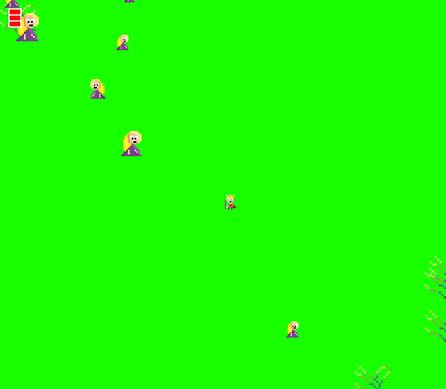

# King eats queens Qt/C++
Simple a game written in Qt framework. The example is largely based on this example(https://inventwithpython.com/squirrel.py).

## Screenshot

## Addons
* [Qt](https://www.qt.io) - Cross-Platform software for embedded & desktop
* [Making Games with Python & Pygame](https://inventwithpython.com/pygame/) - great Pygame examples and a source of knowledge.
* [BG Music](https://opengameart.org/content/8-bit-jester-battle) - opengameart
